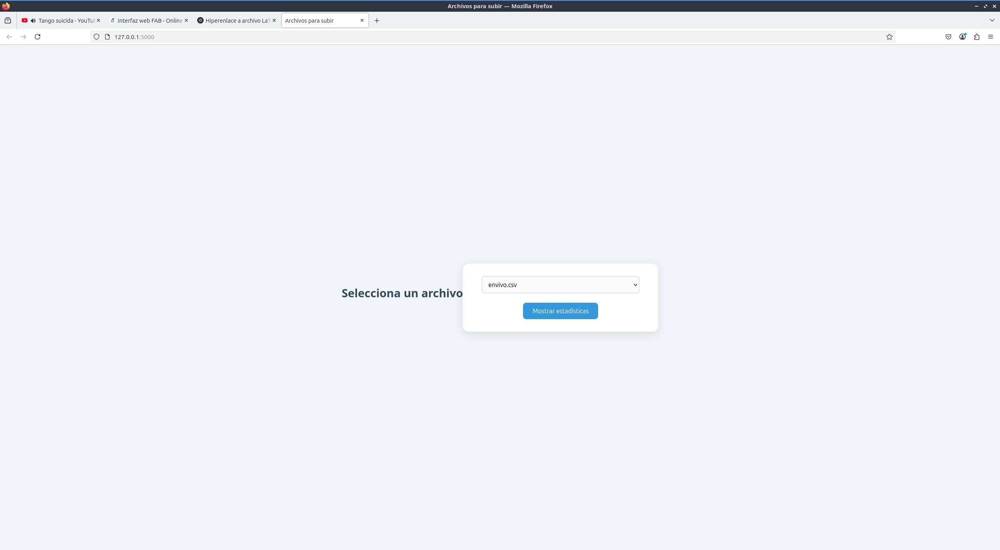
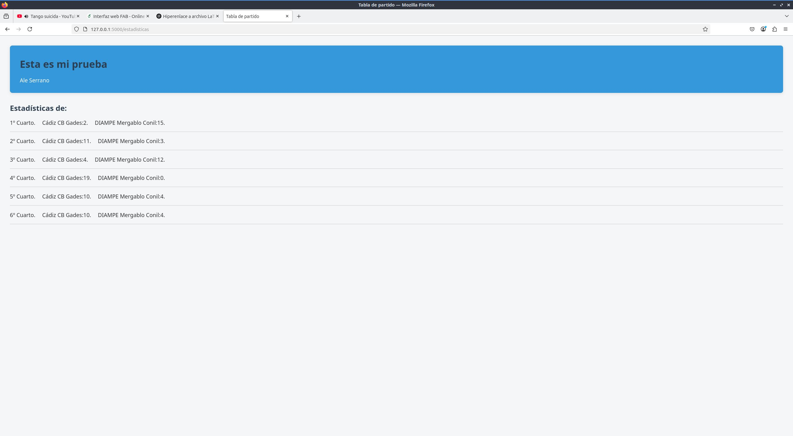

# fabweb
# 📊 Subida y Lectura de Archivos CSV con Flask

Este es un proyecto simple desarrollado con **Flask** que permite visualizar el contenido de un .csv en una tabla. Es ideal como introducción al desarrollo web con Python y manejo de datos.

## 🚀 Funcionalidades

- ⏳ Subida de archivos `.csv` desde la interfaz web
- ✅ Visualización del contenido del archivo en una tabla HTML
- ✅ Validación del tipo de archivo
- ✅ Interfaz limpia y fácil de usar

## 🛠️ Tecnologías utilizadas

- **Backend:** Python 3, Flask
- **Frontend:** HTML5, Bootstrap, Jinja2

## 📷 Vista previa

## Autoría
Este proyecto lo ha realizado Alejandro Serrano.
